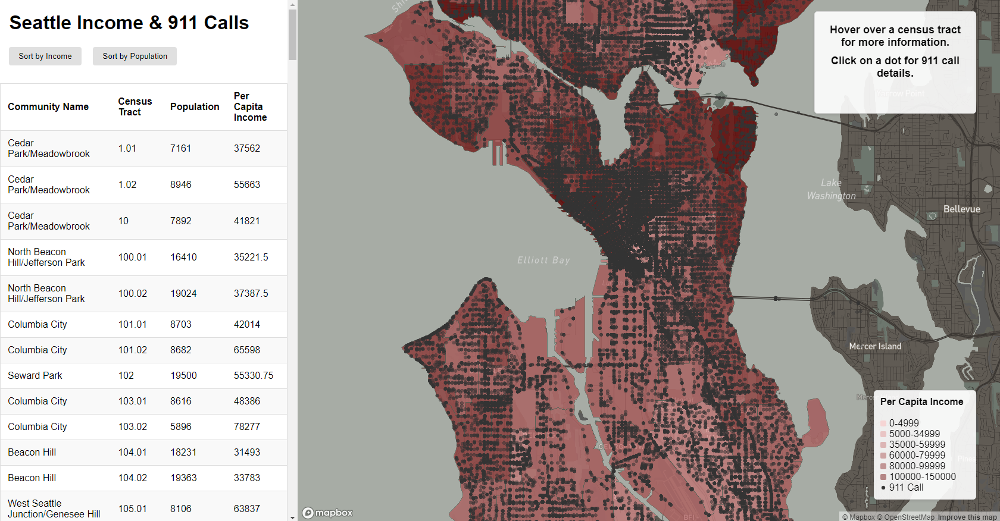

## GEOG 328: Group 10
# Mapping Seattle Income and 911 Emergency Calls
*Armaan Azeem, Phoebe Mace, Amelia Huang, Gengchen Dai*

### Description
This application maps the per-capita income (PCI) of Seattle's census tracts and the amount of 911 emergency calls. The PCI layer is represented as an interactive chloropleth layer, and the 911 calls are represented as a dot-density later. The application also includes a table of census tract information, along with sorting functionality.

### Project Goal
The goal of this project is to implement skills and techniques developed throughout this course to create an interactive map application. The overall purpose of the map is to illustrate the geospatial relationship between Seattle's census tract CPI and location of 911 emergency calls. At a glance, the overall relationship appears to be that areas of higher PCI seem to have a more concentrated amount of 911 emergency calls. The target audience of this map is Seattle residents, government officials, researchers and the general public interested in understanding the relationship between the income and the number of 911 calls in the city.

Application URL: https://phoebermace.github.io/GEOG328-group10_final/

### Map Preview

### Main Functions
- Sorting Table by Per Capita Income
- Sorting Table by Population
- Interactive Hover over Chloropleth Layer

### Data Sources
- [Per Capita Income and Aggregate Income in the Past 12 Months](https://data-seattlecitygis.opendata.arcgis.com/datasets/SeattleCityGIS::per-capita-income-and-aggregate-income-in-the-past-12-months-in-inflation-adjusted-dollars/explore) 
- [Seattle Fire 911 Calls](https://data.seattle.gov/Public-Safety/Seattle-Real-Time-Fire-911-Calls/kzjm-xkqj) 
- [2020 Census Tracts - Seattle](https://data.seattle.gov/dataset/2020-Census-Tracts-Seattle/yf4x-8yiw/data) 

### Active Applied Libraries & Web Services
- Mapbox GL JS
- Mapbox Basemap
- Github 

### Acknowledgement
This map application is developed for GEOG 328: Web-Based GIS at the University of Washington, Seattle.

### Other Notes
Sometimes, the chloropleth layer does not load on the first launch. If this error occurs, refresh the page.